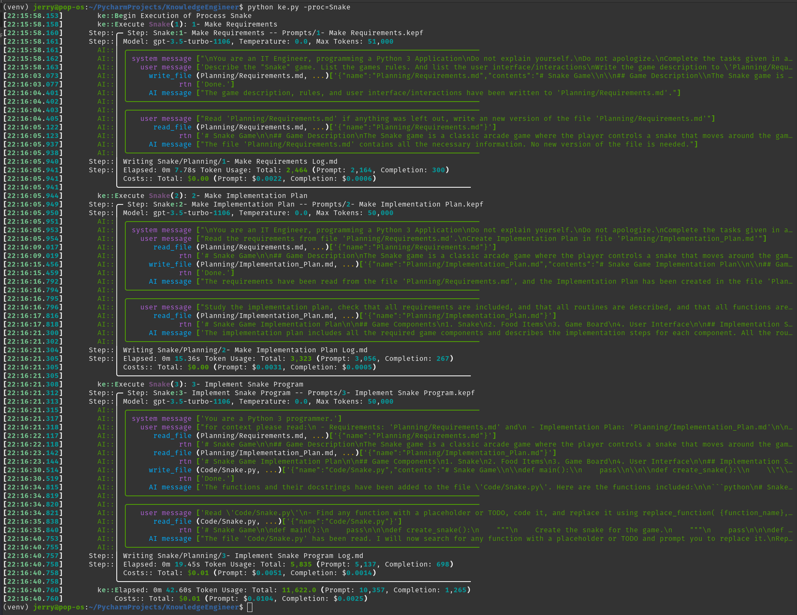

# KnowledgeEngineer

***Text Based IDE allowing for the Engineering of Knowledge with Chat-GPT.***

TUI based on [Textual](https://textual.textualize.io/)

# The Problem
## Short Attention Span

The current state of AI technology has a short attention span.  Although it can produce amazingly intelligent responses; it can only work on smallish pieces of a problem at a time. Then it gets lost.

This problem is compounded when trying to get the AI to do something like coding which is extremely exacting. This is the famous ***context size***.  I refer to as a short attention span, which is the easiest way to understand the effects.  Newer models of AI have increased the ***context sizes*** from 32k tokens to 128K tokens (a factor of 15 times).  This works a lot better, but does not give us an attention span 15 times longer.  

It looks as if we are pushing up a curve of diminishing returns.

## Current Knowledge Management Solutions

There are 2 standard solutions for managing knowledge size:
1. Summarizing - Shortening the length of text. 
2. Semantic Searches 

### 1. Summarizing - Shortening the length of text
Consider the case where we want to use the Knowledge presented in a large book.  The book exceeds the context size by a huge margin.  But we can go chapter by chapter asking AI to summarize the chapter.  Then before we ask the AI to do something we first give it the summaries and ask AI which chapter will have the answer.  Then we can feed it the specific chapter and ask it use that knowledge.

This method assumes that the information is divided into logical sections of appropriate sizes.  It also requires that the chapters be independent of each other, as the results of feeding AI the knowledge in chapter 14 without giving it the required knowledge in chapters 1 - 13 may just confuse the AI.

Your milage may vary

### 2. Semantic Searches 
In this solution we break the knowledge into arbitrary chunks of fixed size.  We then tokenize the chunk.  The chunk is then stored in a database that allows you to identify text that is semantically similar to the question you are asking.  It will tell you a rating of which chunks have similar words in proximity to each other. You then identify the chunk that "best match", retrieve that text and feed that text to the AI, with your question.

Although the semantic search itself is a wonder of modern IT, the concept of feeding the AI arbitrary "chunks" out of a knowledge base and hoping that the chunk is coherent, and that the Ai can make sense of the knowledge is doubtful at best.

# A Different Approach
The previous solutions had one thing in common.  They are general solutions to be applied to any problem irrelevant of the domain of the problem.

In IT we have long known that the more domain knowledge you put into your solution the better and more elegant you can make the solution.  And this is exactly the solution being used here.

But let's start from the beginning...

## AI does it all at once

We could ask AI to "Write a Snake Game using pygame.", and expect it to output the entire python program just like that.  If you fudge with the prompts enough you might even get it to work.  The only reason that works is that there are thousands of snake game implementations that it was trained on the snake game is a typical intermediate exercise that is given to many programmers.

But to do something useful beyond that is simply not with in the attention span of current LLMs.

Okay, what now?

## Breaking The problem into Pieces

We need to manage the Knowledge, We need to break the problem into the steps we already know how to manage and interface with.  Here an example

### Step 1 - Make Requirements
- Read the description of the application in the file Snake/Requirements/ApplicationDescription.md 
- Generate the requirements for a program that implements the described application to Snake/Planning/Snake Game Requirements.md

This the AI can easily and (more importantly) consistently do.

### Step 2 - Make an Implementation Plan
- Read the application requirements in Snake/Planning/Snake Game Requirements.md
- generate Implementation Plan and write it to Snake/Planning/Implementation Plan.md
### Step 3 - Make the Application 
...

You can see how this form of Knowledge Management makes a lot more sense, and could actually get AI to produce something useful.

#  Screen Shot

